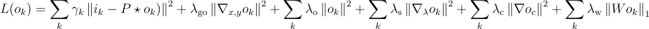

# Deconvolution of SO/PHI data

This code carries out the deconvolution of SO/PHI polarimetric data with the
inferred point spread function (PSF) given in terms of wavefront coefficients in the Zernike basis.

This is done by optimizing the following merit function

The terms are:

- 1st: mean squared error, measuring the difference between the observations and the reconstructed image and the PSF.
- 2nd: l2 regularization for the spatial gradient of the recovered image (this encourages smooth images)
- 3rd: l2 regularization parameter for the value of the recovered image (this encourages the image towards zero in case no information is present)
- 4th: l2 regularization for the spectral gradient of the recovered profile (this encourages the spectral profile to be smooth)
- 5th: l2 regularization for the value at the continuum point (this encourages the continuum value towards zero)
- 6th: l1 regularization for the wavelet decomposition of the image (this encourages the wavelet decomposition to be sparse)

## Requirements

- Python 3.6+
- numpy
- pytorch
- tqdm
- kornia
- ptwt

Optional

- nvitop (for providing information on the GPU usage during the optimization)

## Installation

We recommend to create a new Anaconda environment

    conda create -n deconvolution

And then install the requirements using `pip`:

    pip install numpy tqdm kornia ptwt torch

## Deconvoloution

The main deconvolution code is defined in `deconvolution.py`. The main calling scheme is the following:

    config = {
        'gpu': 0,
        'npix_apodization': 24,
        'psf_modes': coefs,
        'n_pixel': 512,
        'n_iter' : 50,
        'wavelength': 6173.341,
        'diameter': 14.0,
        'pix_size': 0.5,
        'central_obs' : 0.0,        
        'pad_width': pad_width,
        'precision': 'float32',
        'checkpointing': False,
    }

    deconvolver = Deconvolution(config)
        
    rec, rec_H, loss = deconvolver.deconvolve(frames,                                                 
                                                regularize_fourier='mask', 
                                                diffraction_limit=0.90,
                                                lambda_grad=lambda_grad, 
                                                lambda_obj=lambda_obj,
                                                lambda_spectral=lambda_spectral,
                                                lambda_continuum=lambda_continuum,
                                                lambda_wavelet=lambda_wavelet,
                                                wavelet=wavelet)

The configuration is defined currently as a dictionary. The configuration
contains the following information:

- `gpu`: integer indicating which GPU (of those available in the system) will be used. Use -1 for computing in CPU
- `npix_apodization`: total number of pixels for image apodization
- `psf_modes`: vector with the Zernike coefficients of the PSF
- `n_pixel`: number of pixels of the image (equal to the number of pixel of the original image plus twice the `pad_width`)
- `n_iter`: number of iterations
- `wavelength`: wavelength in Angstrom
- `diameter`: diameter of the telescope in cm
- `pix_size`: pixel size in arcsec
- `central_obs`: percentage of the central obscuration
- `pad_width`: number of pixels to 
- `precision`: working precision (`float32` or `float16`)
- `checkpoining`: if True, it uses internal checkpointing, which could reduce the memory consumption while slightly incresing computation time

Once the `Deconvolution` class is instantiated with the configuration, we can carry out
the deconvolution by simply calling the `deconvolve` function. The parameters are the following:

- `frames`: tensor of size [L,S,H,W] to be deconvolved: L is the number of wavelengths, S is the number of Stokes, H and W are the image dimensions            
- `regularize_fourier` (`mask` or `scharmer`): type of Fourier masking for denoising. Defaults to 'mask'.
    - `mask`: simple Fourier filtering with a diffraction mask with a selectable threshold defined with `diffraction_limit`.
- `diffraction_limit` (float, optional): Diffraction limit in the Fourier masking in units of the diffraction limit. Defaults to 0.95.
- `lambda_grad` (float, optional): regularization parameter for the spatial gradient of the recovered image. Defaults to 0.1.
- `lambda_obj` (float, optional): regularization parameter for the value of the recovered image. Defaults to 0.0.
- `lambda_spectral` (float, optional): regularization parameter for the spectral gradient of the recovered profile. Defaults to 0.0.
- `lambda_continuum` (float, optional): regularization parameter for the value of the continuum point. Defaults to 0.0.
- `lambda_wavelet` (float, optional): regularization parameter for the l1 norm of the wavelet decomposition of the recovered image. Defaults to 0.0.
- `wavelet` (str, optional): wavelet family. Defaults to `haar`. All families can be found [here](https://pywavelets.readthedocs.io/en/latest/ref/wavelets.html)

The output of the function are:

- `rec`: recovered image with the same dimensions as the input
- `recH`: recovered image after the Fourier filtering
- `loss`: value of the merit function vs iteration

## Thresholding

A final wavelet threshold can help reduce the noise in the weakest magnetized regions. For this purpose,
you can use the following function:

    rec, rec_H = deconvolver.hard_threshold(rec, rec_H, threshold=1e-2)

where all detail wavelet coefficients smaller in absolute value than `threshold` will be put to zero.